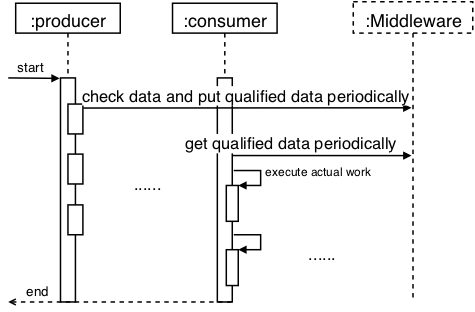
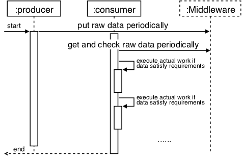
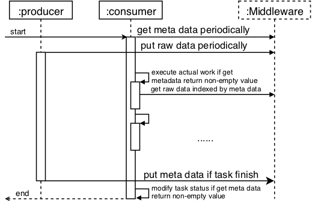
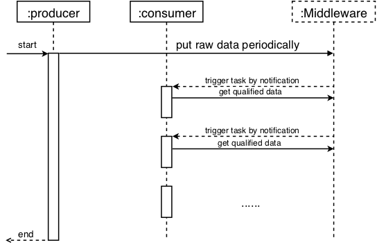

### Typical patterns

The simulation code comes from the https://github.com/pnorbert/adiosvm

We distinguish the patterns according to the strategies of the data checking service. (The place that executes the data checking service)

The typical dynamic task trigger patterns evaluated in this project contains:

Producer-responsible: the data checking service is integrated with the data producer

Consumer-responsible: the data checking service is integrated with the data consumer

Metadata-responsible: the data checking service is integrated with the middleware and the information of the qualified data is acquired by metadata pulling.

Notification-responsible: the data checking service is integrated with the middleware and the information of the qualified data is acquired by the event notification.

The time sequence figures are listed as follows:

Producer-responsible &nbsp;&nbsp;&nbsp;&nbsp;&nbsp;&nbsp;&nbsp;&nbsp;&nbsp;&nbsp;&nbsp;&nbsp;&nbsp;&nbsp;&nbsp;&nbsp;&nbsp;&nbsp;&nbsp;&nbsp;&nbsp;&nbsp;&nbsp;&nbsp;&nbsp;&nbsp;&nbsp;&nbsp;&nbsp;&nbsp;&nbsp;&nbsp;&nbsp;&nbsp;&nbsp;&nbsp;&nbsp;&nbsp;&nbsp;&nbsp;&nbsp;&nbsp;&nbsp; Consumer-responsible

 

Metadata-responsible &nbsp;&nbsp;&nbsp;&nbsp;&nbsp;&nbsp;&nbsp;&nbsp;&nbsp;&nbsp;&nbsp;&nbsp;&nbsp;&nbsp;&nbsp;&nbsp;&nbsp;&nbsp;&nbsp;&nbsp;&nbsp;&nbsp;&nbsp;&nbsp;&nbsp;&nbsp;&nbsp;&nbsp;&nbsp;&nbsp;&nbsp;&nbsp;&nbsp;&nbsp;&nbsp;&nbsp;&nbsp;&nbsp;&nbsp;&nbsp;&nbsp;&nbsp;&nbsp; Notification-responsible

 


### The parameters evaluated in this project

For the task setting, we compare the two cases. The first case is that the simulation is the bottleneck of the workflow execution. The second case is that the simulation execution is not the bottleneck of the workflow execution.

For the data size, we modify the number of the grid generated at each step of the simulation.

We also evaluate how the percentage of interesting things influence the workflow execution for different patterns.

The distribution of interesting things is also evaluated. The interesting things are evenly distributed during the workflow execution or distributed by a centralized pattern.

The frequency of data checking is also evaluated.


### The commands to compile the project on amarel cluster

```
module use /projects/community/modulefiles/
module load gcc/5.4/openmpi/3.1.2-kholodvl
cmake ~/cworkspace/src/DTExp/ -DADIOS2_DIR=~/cworkspace/build/build_ADIOS2/ -DVTK_DIR=~/cworkspace/build/build_vtk -DUSE_TIMERS=ON -DVTK=ON
```